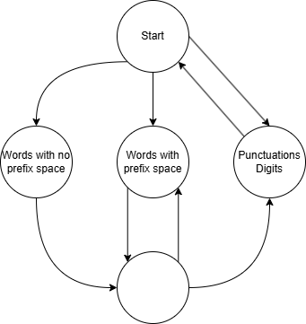

# LLM Thing Explainer

LLM Thing Explainer is inspired by Randall Munroe's ["Thing Explainer: Complicated Stuff in Simple Words"](https://en.wikipedia.org/wiki/Thing_Explainer). This tool uses LLMs to explain complex subjects using only the 1,000 most common English words. By using state machines, this project offers simplified explanations that are accessible to everyone.

## Installation

To get started with the LLM Thing Explainer, you first need to install the required dependencies.

```bash
git clone https://github.com/yourusername/llm-thing-explainer.git
cd llm-thing-explainer
pip install -e .[gradio]
```

## Running the Application
Once you have completed the installation steps, you can run the application using the following command:

```bash
python gradio_app.py
```

The application will launch a web interface, which you can access via your browser in `http://localhost:7860`. The interface allows you to chat with the LLM Thing Explainer, adjust model settings, and enjoy simplified explanations of complex topics.

- `Chat` tab: Chat with LLM Thing Explainer.
- `Settings` tab: Adjust model and word list settings.

## Pre-built Word Lists

- `xkcd 1000 words`: [1000 most common English words](https://xkcd.com/simplewriter/words.js) from Thing Explainer.
- `chinese 500 chars`: Common Chinese 500 characters.
- `chinese 250 chars`: Common Chinese 250 characters.
- `mandarin 500 chars`: Common Mandarin 500 characters.
- `mandarin 250 chars`: Common Mandarin 250 characters.

## Examples

With `xkcd 1000 words`:

> **User:** Explain what is apple.
>
> **Thing Explainer:** Food. Sweet. Grow on tree. Red, green, yellow. Eat. Good for you.

> **User:** Explain the structure of rockets.
>
> **Thing Explainer:** Rocks go up high. They need help. Help is called stages. Stages do work, then stop. New stage comes, does work, then stops. Last stage goes all the way up. It has special thing called engine. Engine makes fire, makes rock go up.

> **User:** What is the meaning of life?
>
> **Thing Explainer:** Life is to live, learn, love, and be happy. Find what makes you happy and do it.

> **User:** A boy gets a decorated envelope from an old woman, he smiles and bows deeply in this cold morning. What's inside the envelope?
>
> **Thing Explainer:** Money. Old woman helps boy.

With `chinese 500 chars`:

> **User:** What is the Chinese of red envelop?
>
> **Thing Explainer:** 它是"利是"。

> **User:** 真正的幸福是什麼？
>
> **Thing Explainer:** 內心平和，身邊有愛。

## How It Works

Logit scores are modified using the `StateMachineLogitsProcessor`. This component integrates a token state machine (`TokenStateMachine`) to filter out invalid next tokens based on predefined valid token transitions. The state machine ensures that the generated tokens adhere to the 1,000 most common words / our valid word list.

I have grouped text into 3 categories:

1. Words with no prefix space. e.g. "word"
2. Words with prefix space. e.g. " word". Helps with preventing the concatenation of two words into a new word that is not within our word list.
3. Punctuations, Digits: special characters.


